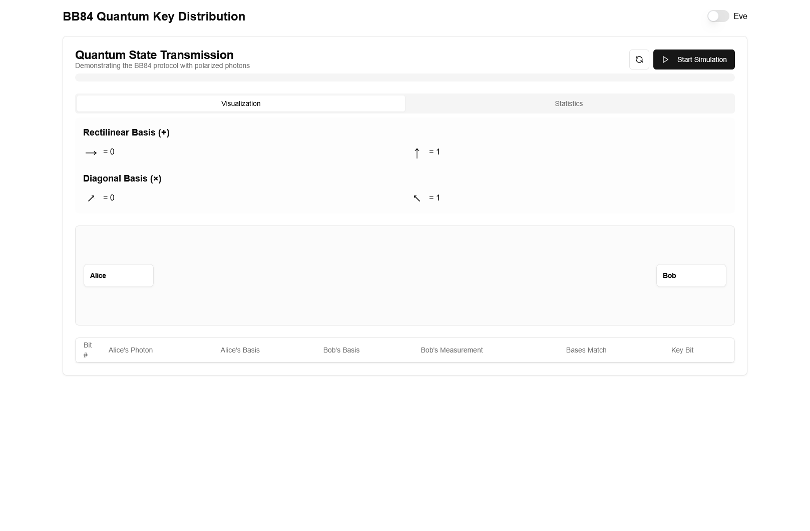

# Quantum Key Distribution (QKD) Simulation

An interactive simulation of the BB84 Quantum Key Distribution protocol, built with Next.js.

## Overview

This project provides a visual and interactive simulation of the BB84 quantum key distribution protocol, one of the first quantum cryptography protocols developed by Charles Bennett and Gilles Brassard in 1984. It demonstrates how quantum mechanics can be used to establish secure communication channels.

Visit the live simulation at [https://qkd-sim.vercel.app](https://qkd-sim.vercel.app)



## What is Quantum Key Distribution?

Quantum Key Distribution is a secure communication method that uses principles of quantum mechanics to establish a shared secret key between two parties (usually called Alice and Bob). The security of this key exchange comes from the fundamental properties of quantum mechanics:

1. **Quantum Measurement**: The act of measuring a quantum system disturbs it
2. **No-Cloning Theorem**: It's impossible to create a perfect copy of an unknown quantum state

This simulation specifically implements the BB84 protocol which uses quantum states of polarized photons to exchange secret keys.

## Features

- **Interactive Visualization**: See the quantum states and their transmission in real-time
- **Basis Explanation**: Visual guide to the rectilinear and diagonal bases used in QKD
- **Eve Simulation**: Toggle an eavesdropper to see how interception affects key generation
- **Detailed Statistics**: Track the transmission process and observe the final key generation
- **Quantum State Representation**: Visual representation of quantum polarization states

## Getting Started

### Prerequisites

- Node.js 14.x or later
- npm or yarn

### Installation

```bash
# Clone the repository
git clone https://github.com/RuchirKalokhe/QKD_sim
cd qkd-simulation

# Install dependencies
npm install
# or
yarn install
```

### Running the Simulation

```bash
npm run dev
# or
yarn dev
```

Open [http://localhost:3000](http://localhost:3000) with your browser to see the simulation.

## How It Works

The simulation demonstrates these key steps of the BB84 protocol:

1. **Quantum Transmission**: Alice sends photons polarized randomly in one of four states
2. **Basis Selection**: Bob measures each photon using randomly selected bases
3. **Public Discussion**: Alice and Bob compare which bases they used (but not the actual results)
4. **Key Sifting**: They keep only results where they used the same basis
5. **Error Estimation**: In a real implementation, they would check for errors that might indicate eavesdropping

With the "Eve" toggle, you can see how an eavesdropper disrupts the communication, introducing errors that can be detected.

## Technical Details

This project is built with:

- **Next.js** - React framework
- **TypeScript** - For type safety
- **Canvas API** - For rendering quantum states
- **Shadcn/ui** - For the UI components

## Learn More About QKD

To learn more about Quantum Key Distribution:

- [Quantum Cryptography on Wikipedia](https://en.wikipedia.org/wiki/Quantum_cryptography)
- [BB84 Protocol Explained](https://en.wikipedia.org/wiki/BB84)
- [Introduction to Quantum Computing](https://qiskit.org/textbook/preface.html) - IBM's Qiskit Textbook

## Contributing

Contributions are welcome! Please feel free to submit a Pull Request.
